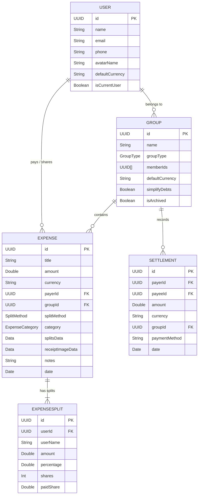
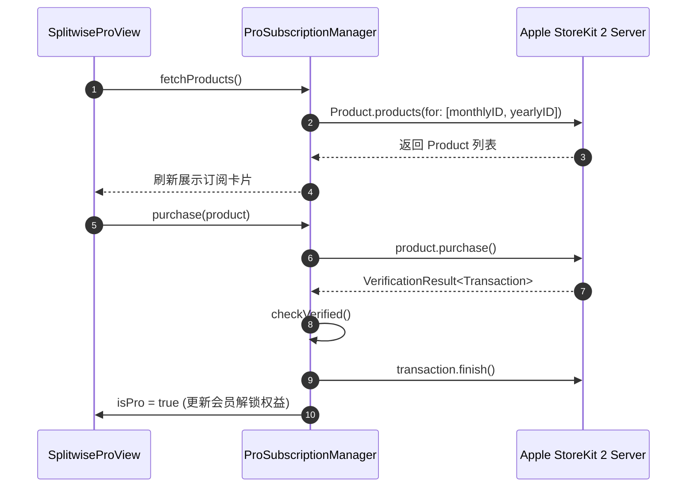

# Technical Architecture & System Design - Splitwise iOS App

---

## 1. 架构总览 (Architecture Overview)

本项目采用现代 iOS **Layered Architecture (分层架构)** 配合 SwiftUI 的响应式机制：
- **Presentation Layer (视图层)**：SwiftUI 视图、自适应导航 (`NavigationSplitView` / `TabView`)、组件。
- **Domain & State Layer (业务逻辑与状态层)**：`@Observable` 状态容器 (`AppState`, `ProSubscriptionManager`)、债务简化算法引擎 (`DebtSimplifier`)。
- **Data Persistence Layer (数据持久化层)**：iOS 17 **SwiftData** 引擎 (`ModelContainer`, `ModelContext`, `@Model` 实体)。

```mermaid
graph TD
    subgraph Presentation Layer [UI 视图层]
        MainView[MainView - 自适应导航]
        GroupViews[GroupListView / GroupDetailView / SimplifyDebtsView]
        ExpenseViews[AddExpenseView / SplitOptionsView / ReceiptPickerView]
        AnalyticsViews[ChartsView / ExportReportView]
        AccountViews[AccountView / SplitwiseProView]
    end

    subgraph Domain & Logic Layer [业务逻辑层]
        AppState[@Observable AppState - 全局偏好状态]
        DebtSimplifier[DebtSimplifier - 债务极简匹配算法]
        ProManager[ProSubscriptionManager - StoreKit 2 管理]
        OCRService[ReceiptScannerService - Vision AI 识别]
        ExportManager[ExportManager - PDF/CSV 生成器]
    end

    subgraph Data Layer [数据持久化层]
        SwiftData[SwiftData ModelContainer & Context]
        UserModel[@Model User]
        GroupModel[@Model Group]
        ExpenseModel[@Model Expense]
        SettlementModel[@Model Settlement]
        ActivityLogModel[@Model ActivityLog]
    end

    MainView --> GroupViews
    MainView --> ExpenseViews
    MainView --> AnalyticsViews
    MainView --> AccountViews

    GroupViews --> DebtSimplifier
    ExpenseViews --> OCRService
    AnalyticsViews --> ExportManager
    AccountViews --> ProManager

    GroupViews --> SwiftData
    ExpenseViews --> SwiftData
    AnalyticsViews --> SwiftData
    
    SwiftData --> UserModel
    SwiftData --> GroupModel
    SwiftData --> ExpenseModel
    SwiftData --> SettlementModel
    SwiftData --> ActivityLogModel
```

---

## 2. 数据模型架构 (Data Persistence Schema)

应用使用 SwiftData (`@Model`) 管理持久化存储，实体结构如下：



---

## 3. 核心算法设计：最少笔数债务简化 (Debt Simplification)

### 3.1 算法计算步骤
当计算某个群组的简化欠款时，算法执行如下三步：

1. **计算净余额矩阵 (Net Balance)**：
   $$\text{Net}[u] = \sum \text{PaidOut}[u] - \sum \text{OwedAmount}[u] + \text{SettlementsReceived}[u] - \text{SettlementsPaid}[u]$$

2. **池化拆分 (Creditor & Debtor Pools)**：
   - 债权人集合 $C = \{ u \mid \text{Net}[u] > +0.009 \}$ (按欠款金额从大到小排序)
   - 债务人集合 $D = \{ u \mid \text{Net}[u] < -0.009 \}$ (按欠款金额绝对值从大到小排序)

3. **Greedy Min-Flow 贪心匹配**：
   每次匹配最大债务人 $d \in D$ 与最大债权人 $c \in C$：
   $$\text{SettleAmount} = \min(- \text{Net}[d], \text{Net}[c])$$
   生成一条由 $d \to c$ 转账 $\text{SettleAmount}$ 的极简交易；扣减对应余额直至两池清零。

算法复杂度为 $O(N \log N)$（$N$ 为群组人数），能成功将原本最坏 $O(N^2)$ 的转账网络压缩至最多 $N-1$ 笔交易。

---

## 4. 关键服务模块流程

### 4.1 StoreKit 2 订阅生命周期 (`ProSubscriptionManager.swift`)



### 4.2 Vision OCR 小票识别管道 (`ReceiptScannerService.swift`)

1. 用户拍摄/选择图片 $\to$ 提取 `CGImage`
2. 创建 `VNRecognizeTextRequest`，配置 `recognitionLevel = .accurate`
3. 执行正则表达式 `(\d+\.\d{2})` 解析候选行中的金额与项目名称
4. 结构化构建 `ScannedReceiptResult(title, totalAmount, lineItems)`

---

## 5. 编译与平台适配构建 (Build Configurations)

- **条件编译处理**：使用 `#if canImport(UIKit)` 与 `#if os(iOS)` 隔绝 Mac/iOS 专用 API（如 `navigationBarTitleDisplayMode`, `keyboardType`, `UIImage`），确保跨平台编译零报错。
- **StoreKit 沙盒配置文件**：包含 `Resources/StoreKit.storekit`，可在 Xcode 环境变量中直连沙盒环境测试内购。
