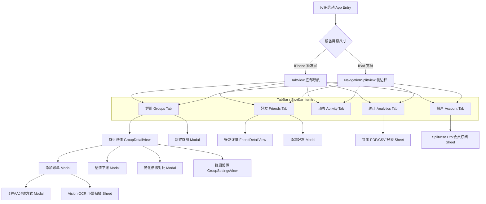

# UI/UX Prototype & Screen Flow Specification - Splitwise iOS App

---

## 1. 全局页面流程图 (Global Screen Navigation Flow)



---

## 2. 界面布局规格 (Screen Specs)

### 2.1 首页群组列表 (`GroupListView.swift`)
- **头部**：包含全员汇总卡片 (Overall Balance Card)，高亮显示“你在所有群组总计借出/应还金额”。
- **分类标签 (Segmented Control)**：支持在“Active (活动中群组)”与“Archived (归档群组)”间切换。
- **群组行卡片**：展示群组分类图标、群组名、成员人数、简化债务开关状态及个人净余额角标 (`BalanceBadge`)。

### 2.2 群组明细页 (`GroupDetailView.swift`)
- **顶部 Header**：群组图标、总消费金额。
- **快捷按钮组**：`Settle Up (结清)`、`Simplify (简化债务)`、`Export (导出报表)`。
- **成员余额滑动气泡**：横向 ScrollView 展示每位成员当前受收/欠款状态。
- **悬浮按钮 (FAB)**：右下角常驻 `+ Add Expense` 按钮。

### 2.3 账单添加与分摊交互 (`AddExpenseView.swift` & `SplitOptionsView.swift`)
- **描述与金额输入**：支持选择分类、大字号金额输入、币种快捷 Picker。
- **5 种分摊切换**：

```
[ =/= Equal ]  [ $ Exact ]  [ % Percentage ]  [ 1x Shares ]  [ 🧾 Itemized ]
```

### 2.4 Splitwise Pro 会员卡片 (`SplitwiseProView.swift`)
- **金黄渐变 Crown 标题**
- **功能对照表** (OCR小票、实时汇率、PDF导出、高级图表、债务极简算法、无广告)
- **StoreKit 2 月度与年度订阅方案卡片**

---

## 3. 设计令牌交叉引用 (Design Tokens Reference)

详细色彩 HEX、字号 Spec、Padding 间距请参阅：[design_tokens.md](../design_tokens.md)。
